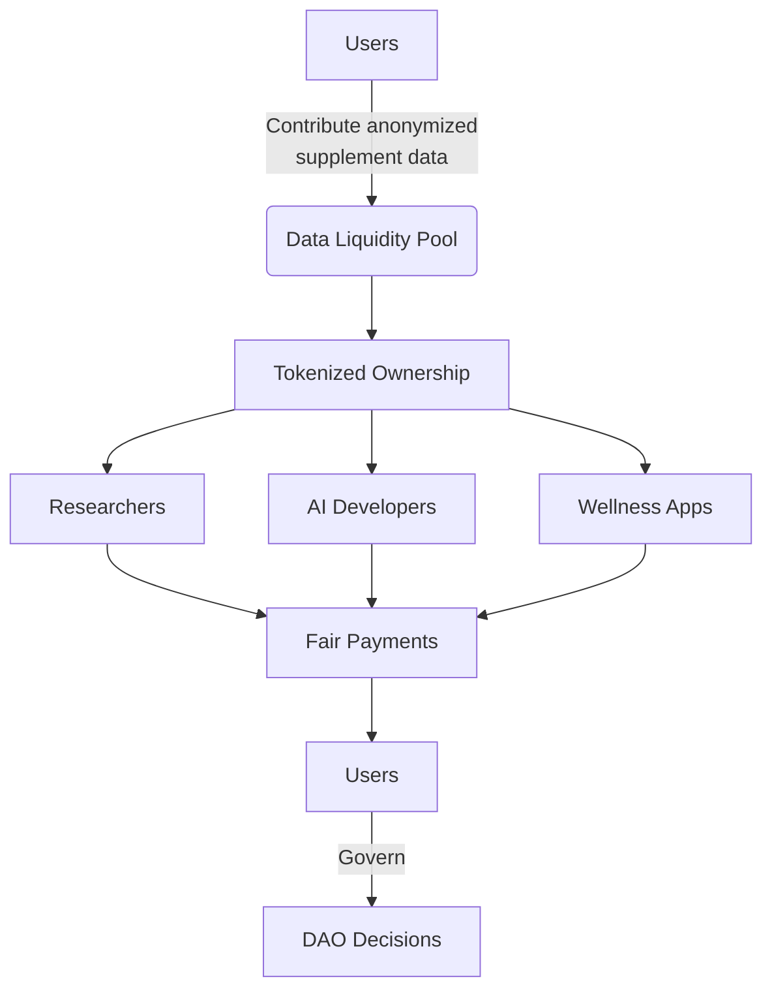

### 🌐 The DataChain Collective & NutriDAO

**DataChain Collective: Redefining Data Ownership**  
We're a pioneering organization building decentralized DataDAOs where communities reclaim sovereignty over their most valuable asset: data. Founded on the principle that data should serve people – not corporations – we combine blockchain technology and privacy-preserving AI to create:

- **User-Owned Data Economies**  
  Where individuals profit from their data contributions  
- **Community-Governed AI**  
  Where algorithms serve collective interests, not corporate agendas  
- **Ethical Data Ecosystems**  
  Where transparency replaces exploitation  

**Why We Exist**  
In a world where $500B+ in annual data value flows to tech giants while data creators receive nothing, we're building a fairer alternative. Our solution: Tokenized Data Liquidity Pools (DLPs) that transform passive data into active, reward-generating assets.

---

### 🥗 NutriDAO: Our Flagship Health Initiative

**Born from Urgent Needs:**  
1. 72% of supplement research uses biased commercial data  
2. Consumers receive 0% value from $1.2T wellness data market  
3. AI health tools lack diverse, ethically-sourced training data  

**Our Response:**  
As the first medical DataDAO in the DataChain Collective, NutriDAO pioneers:  

**Why This Matters for Health Innovation:**  
- 🧪 **Breakthrough Research** - Access to 100% real-world supplement usage data  
- 🛡️ **Privacy by Design** - Zero personally identifiable information (PII) exposed  
- 💰 **Value Circulation** - 60% of data revenue returned to contributors  

---

### ⚖️ Our Governance Philosophy

**Guided by Three Pillars:**  
1. **Radical Transparency**  
   - All algorithmic decisions open-sourced  
   - Quarterly value distribution audits  
2. **Participatory Control**  
   - One token = One vote on data usage  
   - Community veto rights on commercial partnerships  
3. **Intergenerational Fairness**  
   - 15% treasury allocation for future health data initiatives  
   - Legacy rewards for long-term contributors  

---

### 🌱 Our Roots in the Vana Ecosystem

**More Than Infrastructure – A Shared Mission**  
As core contributors to Vana's decentralized data ecosystem, we're aligned with their vision for human-centric AI. This partnership provides:

**Built During Vana Academy:**  
- Week 1-3: Validated nutritional data demand with 23 research institutions  
- Week 4-5: Implemented HIPAA-compliant FHIR mappings via OpenFHIRChain  
- Week 6-8: Onboarding first 1,200 data contributors (target: 10k by Q4 2025)  

---

### 🧠 The Minds Behind the Mission

| Role | Name | Focus Area |  
|------|------|------------|  
| **Lead Architect** | Dr. Elena Torres | Healthcare Blockchain & FHIR Standards |  
| **DAO Economist** | Marcus Reynolds | Tokenomics & Value Distribution |  
| **Chief Ethics Officer** | Priya Sharma | AI Alignment & Consent Frameworks |  
| **Medical Advisor** | Dr. Kenji Sato | Nutritional Science & FDA Compliance |  

*"NutriDAO represents healthcare's next evolution: where patients become partners in discovery."*  
– Dr. Kenji Sato, Former WHO Nutrition Director

---

### 🤝 Strategic Allies
- **Research Partners**  
  [UC Berkeley School of Public Health Logo] • [Mayo Clinic Innovation Logo]  
- **Tech Enablers**  
  [Vana Logo] • [Filecoin Foundation Logo] • [HL7 International Logo]  
- **Industry Validators**  
  [NIH Grant Award Badge] • [Y Combinator Alumni Badge]  

---

### 📜 Our Commitment to You
We pledge to:  
- Never sell or lease personal data  
- Maintain open-source core infrastructure  
- Distribute >60% value to data contributors  
- Reject partnerships violating ethical guidelines  
- Sunset data pools if governance thresholds breached  

**This isn't just technology – it's a new social contract for the data age.**